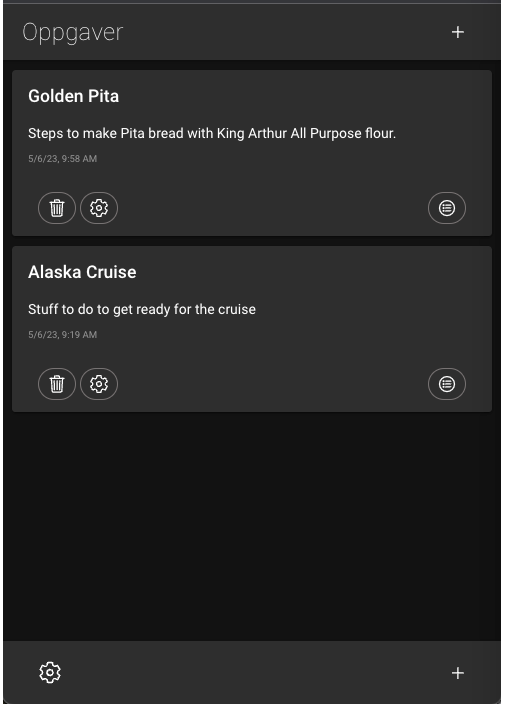
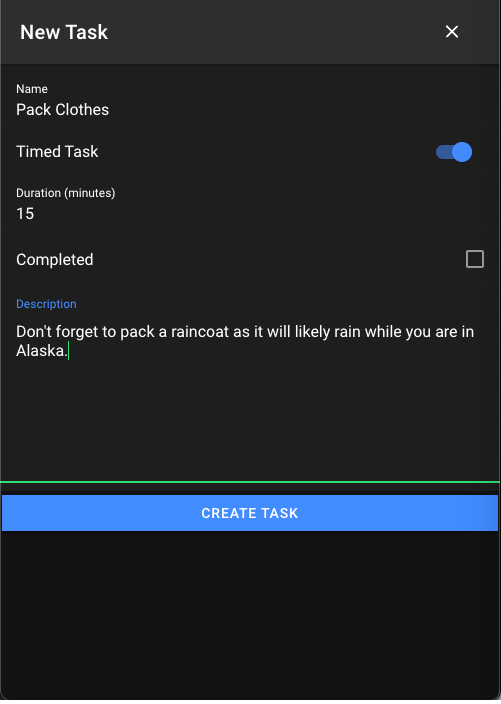

# Oppgaver

Ionic Task Timer application

# Setup

1. Install Node.
2. Install Angular cli - 15.0.0
3. Install Ionic - ^6.1.9
4. Install Ionic Storage - ^3.0.6
5. Clone the GitHub repository

# Run

1. Run - ionic build - in the console at the root of the app.
2. Start - ionic serve - in the conole and then open browser at http://http://localhost:8100

# Usage

1. On the main page click the plus sign to create a new Task List.
2. Once a Task List is created click to expand the Task List.
3. Click the list icon to add new tasks.
4. On the Task page click the plus icon to add a new task.
5. Enter the Task details.
6. If the task has a time length, to activate the timer expand the task and click the timer icon.

# Settings

1. To reset the local database instance click the home page icon. On the home page click the gear in the lower left. Expand the database item. Click the Reset Database button. Confirm purge to reset the database.
2. To see a sample task list, click the Add Sample Task List button.

# About

1. All code written by Haakon Hestness - http://www.letsmakeawesome.com
2. Oppgaver is Norwegian for "Tasks".

